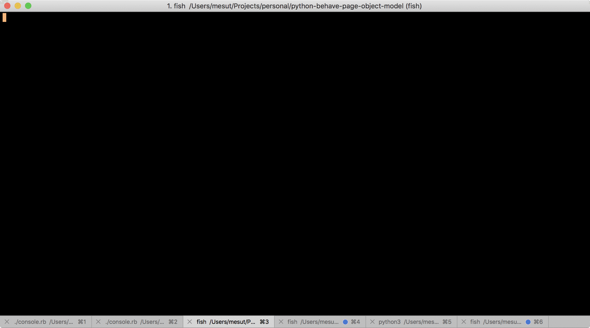

# Python Selenium Behave Page-Object-Model(POM) Docker
Run your Selenium BDD test cases in Docker. Python, Selenium, Behave, Chrome, Docker.

# Demo
**`Behave`** is Python-Selenium equivalent of **`Cucumber`** Ruby-Capybara. You can run your BBD test cases in the same way with some little differences. See the demo which runs Behave in Docker:

